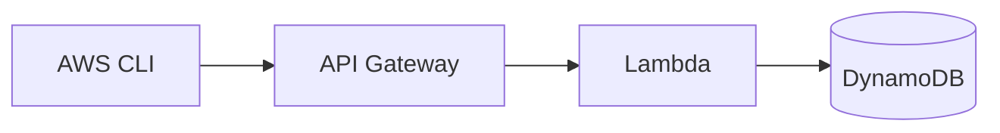

# Tutorial template

Every tutorial in `tutorials/` follows this structure. Consistency is the point:
a student who finishes one tutorial should already know how to read the next.

Copy this file to `tutorials/NN-service/README.md` and fill it in.

---

## Sections, in order

### 1. What you'll build

One paragraph plus a diagram. The student should be able to decide in ten
seconds whether this is the tutorial they want. Diagrams go inline as Mermaid
so they render on GitHub and need no build step:

````

````

### 2. Why this service

Two or three sentences of real-world grounding. What problem does it solve,
and where would a student actually meet it? Not marketing copy -- the honest
version. This is the section that separates a tutorial from `--help` output.

### 3. Prerequisites

Always link back to `tutorials/00-setup/`. List anything extra this tutorial
needs (Docker for Lambda, `zip`, a language runtime).

State the time estimate. Target 45-60 minutes.

### 4. Start the emulator

```bash
floci start
eval $(floci env)
```

### 5. Walkthrough (CLI)

Numbered steps. Every command copy-pasteable, one command per block, no `$`
prompt prefix and no interleaved output inside the fence. Show expected output
in a *separate* block underneath so the student can diff against reality.

Explain the *why* of each flag the first time it appears. Don't explain it
again in later tutorials -- link back instead.

### 6. The same thing in code

Both `python/` (boto3) and `node/` (AWS SDK v3). Keep the two implementations
behaviourally identical so a student can read whichever language they know and
map it onto the other. Each directory is runnable standalone.

The only Floci-specific line is the endpoint override, and it should be called
out explicitly every time:

```python
import boto3

# The ONLY difference from real AWS: point the client at Floci.
# Drop endpoint_url and this identical code runs against a real account.
s3 = boto3.client("s3", endpoint_url="http://localhost:4566")
```

That line is the entire pedagogical argument for this repo. Make it visible.

### 7. Verify

Describe what `./verify.sh` checks, then:

```bash
./verify.sh
```

### 8. Clean up

How to tear down. Note that `floci stop` discards everything unless the
student started with `--persist`.

### 9. How this differs from real AWS

**Required section. Never omit it, never leave it empty.**

Fill this from `docs/COVERAGE.md` and from what you hit while writing. If you
found nothing, say what you specifically checked and found equivalent. A
student who later moves to a real AWS account must not be ambushed by
something this repo glossed over.

Good entries look like:

> - IAM policies are accepted and stored, but **not enforced** on most calls.
>   A request that would be denied in real AWS will succeed here. Don't use
>   these tutorials to learn least-privilege policy authoring.
> - Presigned URL expiry is honoured, but clock skew tolerance differs.

### 10. Exercises

Exactly three, increasing in difficulty:

1. A small variation on what they just did (change a parameter, add a field).
2. Combine this service with one from an earlier tutorial.
3. Open-ended -- design something, or find the emulator's edge.

Do not include solutions. Do include a hint for #3.

---

## Rules for verify.sh

- Source `scripts/lib.sh`. Use `pass` / `fail` / `assert_*` -- never bare `echo`.
- Must be idempotent: safe to run twice in a row. Suffix resource names with
  `$$` or a timestamp.
- Must clean up after itself, including on failure (`trap ... EXIT`).
- Must exit non-zero on any failure. `summary` does this for you.
- Must not depend on any other tutorial having run first.
- Must finish in under two minutes. If it can't, it's testing too much.

## Style

- Second person: "you create a bucket", not "we create a bucket".
- No "simply", "just", "obviously", "as you can see".
- Prefer showing a failure and its fix over pretending the happy path is
  the only path.
- Every claim about Floci behaviour must be one you actually observed. If you
  are inferring, say you are inferring.
