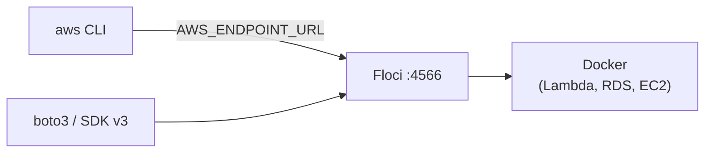

# 00 — Setup

**Time: 20 minutes.** Do this once. Every other tutorial assumes it's done.

## What you'll build

A working local AWS environment: Floci running in Docker, the AWS CLI talking
to it instead of to Amazon, and a verified round-trip.



## Why bother

Learning AWS normally means creating an account, attaching a credit card, and
hoping you remember to tear down that NAT Gateway. Floci removes all of that:
it speaks the real AWS wire protocol on `localhost`, accepts any credentials,
and costs nothing. The code you write here runs unchanged against real AWS —
you delete one line.

That's the trade you're making, and it's worth being clear-eyed about it:
you get free, fast, offline iteration, and you give up perfect fidelity. Each
tutorial ends with a section listing exactly where the two diverge.

## Prerequisites

- **Docker** — Floci is a container, and Lambda/RDS/EC2 launch further
  containers underneath. Non-negotiable.
- **AWS CLI v2** — v1 does not support `AWS_ENDPOINT_URL`.
- **Python 3.9+** and **Node 18+** — only for the SDK sections.

Check what you have:

```bash
docker --version && aws --version && python --version && node --version
```

## 1. Install Floci

Windows (PowerShell):

```powershell
irm https://floci.io/install.ps1 | iex
```

macOS / Linux:

```bash
curl -fsSL https://floci.io/install.sh | sh
```

Confirm:

```bash
floci --version
```

## 2. Start the emulator

```bash
floci start
```

Startup is fast — a native GraalVM binary, roughly 24ms to boot with a ~13 MiB
idle footprint. If it takes noticeably longer, that's Docker pulling the image
on first run, not Floci.

## 3. Point your shell at it

```bash
eval $(floci env)
```

On PowerShell, `floci env` prints the equivalent `$env:` assignments — run
`floci env` alone first to see what it's setting.

It exports four things:

| Variable | Value | Why |
|---|---|---|
| `AWS_ENDPOINT_URL` | `http://localhost:4566` | Redirects every SDK/CLI call to Floci |
| `AWS_ACCESS_KEY_ID` | `test` | Floci validates the SigV4 *shape*, not the secret |
| `AWS_SECRET_ACCESS_KEY` | `test` | Same |
| `AWS_DEFAULT_REGION` | `us-east-1` | Region is still part of the request signature |

The credentials are deliberately fake. Floci has no auth backend — anything
that looks like a valid signature is accepted. This is also why you must never
expose it beyond `localhost`.

## 4. Verify the round-trip

```bash
aws s3 mb s3://hello-floci
```

```bash
aws s3 ls
```

You should see `hello-floci`. If you do, your CLI just made a real SigV4-signed
S3 API call that never left your laptop.

## 5. Optional: the local console

Floci ships a web UI resembling the AWS Console, useful for seeing state you
created from the CLI:

```bash
floci ui
```

## Verify

```bash
./verify.sh
```

Checks Docker is up, Floci is reachable, credentials resolve, and a full S3
create/write/read/delete cycle succeeds.

## Clean up

```bash
floci stop
```

**This discards all state.** To keep it across restarts:

```bash
floci start --persist ./data
```

Or take a named snapshot before stopping:

```bash
floci snapshot save before-experiment
```

## How this differs from real AWS

- **No authentication, at all.** Any credential string works, and IAM policies
  are stored but largely not enforced. A call that real AWS would deny with
  `AccessDenied` will very likely succeed here. Tutorial `06-iam` covers this
  in detail — until then, don't assume anything you learn here about
  permissions transfers.
- **One account, one region, by default.** Cross-account and cross-region
  behaviour is not exercised by these tutorials.
- **No cost, no quotas, no throttling.** Real AWS will rate-limit and bill you.
  Nothing here teaches you to feel that.
- **Some services are Docker-backed rather than emulated** — Lambda, RDS, EC2,
  ECS, OpenSearch run genuine engines in containers. Those behave *very* close
  to real. Purely emulated services are the ones to be careful with.

## Exercises

1. Stop Floci, restart it, and confirm `hello-floci` is gone. Then repeat with
   `--persist ./data` and confirm it survives.
2. Run `floci env` and set the same four variables by hand in a fresh shell
   without using `eval`. Verify `aws s3 ls` still works. Why does region matter
   if there's only one?
3. Floci also emulates Azure (`:4577`), GCP (`:4588`) and OCI (`:4599`). Start
   `floci-gcp`, create a Cloud Storage bucket with `gsutil` or `gcloud`, and
   write down what changed about the auth story compared to AWS.
   *Hint: think about what replaces SigV4.*
