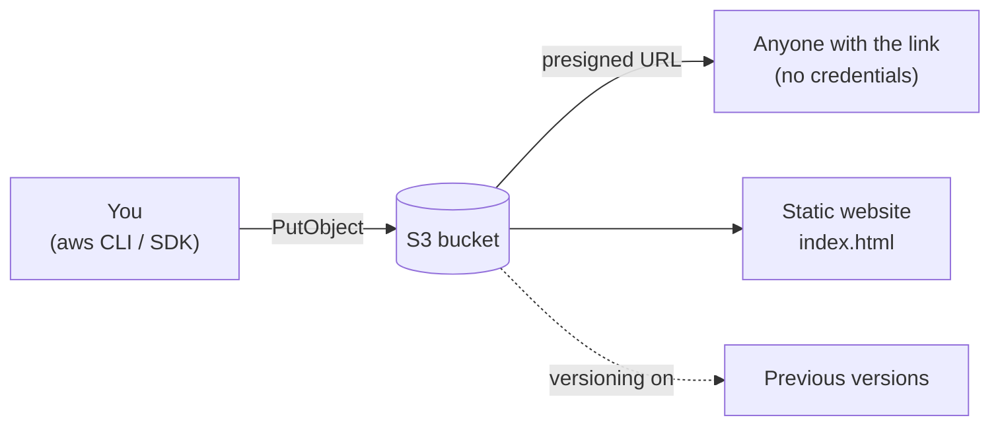

# 01 - S3: object storage

**Time: 50 minutes.** Assumes [`00-setup`](../00-setup/) is done.

## What you will build

A bucket that stores files, hands out time-limited download links to people
who have no AWS credentials, keeps old versions of overwritten objects, and
serves a static website.



## Why S3

S3 is the default answer to "where do we put this file". Uploads, backups,
logs, build artifacts, static sites, and the storage layer under most data
pipelines. It is the oldest AWS service and the one you are most certain to meet.

Two ideas here matter more than the API surface. **Presigned URLs** let you
grant temporary access to a single object without giving anyone credentials -
that is how "download your invoice" links work. **Versioning** turns a delete
into a tombstone rather than a loss.

## Prerequisites

Floci running:

```bash
floci start && eval $(floci env)
```

## 1. Create a bucket

```bash
aws s3api create-bucket --bucket floci-demo
```

Bucket names are globally unique in real AWS - `floci-demo` is almost certainly
taken there. Locally you have the namespace to yourself, which is itself a
divergence worth remembering.

```bash
aws s3api list-buckets --query 'Buckets[].Name' --output table
```

## 2. Put an object in it

```bash
printf 'the quick brown fox\n' > sample.txt
```

```bash
aws s3api put-object --bucket floci-demo --key notes/sample.txt --body sample.txt
```

Note the key is `notes/sample.txt`. S3 has **no directories** - that slash is
just a character in the key. The console draws folders by splitting on `/`, but
nothing hierarchical exists underneath.

List with a prefix to see the illusion working:

```bash
aws s3api list-objects-v2 --bucket floci-demo --prefix notes/ --query 'Contents[].{Key:Key,Size:Size}' --output table
```

## 3. Read it back

```bash
aws s3api get-object --bucket floci-demo --key notes/sample.txt downloaded.txt
```

```bash
cat downloaded.txt
```

## 4. Presigned URLs

The interesting one. Generate a link that works for five minutes, for someone
with no AWS access at all:

```bash
aws s3 presign s3://floci-demo/notes/sample.txt --expires-in 300
```

Copy that URL and fetch it with no credentials in the environment:

```bash
curl -s "$(aws s3 presign s3://floci-demo/notes/sample.txt --expires-in 300)"
```

Look at the URL itself. The signature, expiry, and your access key ID are all
query parameters. Nothing secret is in there - the signature proves you
authorised this exact object for this exact window, and it cannot be edited to
mean anything else.

## 5. Versioning

Turn versioning on **before** putting the objects you care about. The next
section explains why that ordering matters more here than it does on real AWS.

```bash
aws s3api put-bucket-versioning --bucket floci-demo --versioning-configuration Status=Enabled
```

```bash
aws s3api get-bucket-versioning --bucket floci-demo
```

Now write a new key twice:

```bash
printf 'draft one\n' > draft.txt
```

```bash
aws s3api put-object --bucket floci-demo --key drafts/essay.txt --body draft.txt
```

```bash
printf 'draft two\n' > draft.txt
```

```bash
aws s3api put-object --bucket floci-demo --key drafts/essay.txt --body draft.txt
```

Each `put-object` returned a `VersionId`. Both versions exist:

```bash
aws s3api list-object-versions --bucket floci-demo --prefix drafts/ --query 'Versions[].{Key:Key,Id:VersionId,Latest:IsLatest}' --output table
```

### The ordering trap

Objects written **before** versioning was enabled behave differently, and this
is where Floci and real AWS part company.

`notes/sample.txt` from step 2 predates versioning. Look at it:

```bash
aws s3api list-object-versions --bucket floci-demo --prefix notes/ --query 'Versions[].{Key:Key,Id:VersionId}' --output table
```

Its version ID is the literal string `null`. That matches real AWS exactly -
pre-versioning objects get a `null` version ID rather than a generated one.

Now overwrite it and list again:

```bash
printf 'replacement\n' > sample.txt
```

```bash
aws s3api put-object --bucket floci-demo --key notes/sample.txt --body sample.txt
```

```bash
aws s3api list-object-versions --bucket floci-demo --prefix notes/ --query 'Versions[].{Key:Key,Id:VersionId}' --output table
```

On **real AWS** you would now see two entries: the `null` version holding your
original content, plus the new version. The original stays retrievable with
`--version-id null`.

On **Floci 0.2.0** the `null` version is **gone**. Only the new version remains,
and the original content cannot be recovered:

```bash
aws s3api get-object --bucket floci-demo --key notes/sample.txt --version-id null recovered.txt
```

That fails. No error was raised during the overwrite, and nothing in
`list-object-versions` records that the old content ever existed.

This is the most consequential divergence in this tutorial. Turning versioning
on for a bucket that already holds data does **not** protect that data here,
even though `get-bucket-versioning` reports `Enabled`. If you are practising a
backup or retention workflow, practise it on keys written after versioning was
turned on, or you will be rehearsing a procedure that does not do what you
think it does.

Fetch the older one by ID (substitute a `VersionId` from the table above):

```bash
aws s3api get-object --bucket floci-demo --key drafts/essay.txt --version-id VERSION_ID old.txt
```

Versioning cannot be turned off once enabled - only suspended. That is true in
real AWS too, and it is a common source of surprise storage bills.

## 6. Static website hosting

```bash
printf '<h1>Served from S3</h1>\n' > index.html
```

```bash
aws s3api put-object --bucket floci-demo --key index.html --body index.html --content-type text/html
```

```bash
aws s3api put-bucket-website --bucket floci-demo --website-configuration '{"IndexDocument":{"Suffix":"index.html"}}'
```

```bash
curl -s http://localhost:4566/floci-demo/index.html
```

Setting `--content-type` matters: S3 stores whatever you tell it and serves
that back verbatim. Omit it and browsers will download your HTML instead of
rendering it.

## 7. The same thing in code

Both implementations do the identical sequence: create, upload, presign, fetch
via the presigned URL, list versions, clean up.

```bash
cd python && pip install -r requirements.txt && python s3_demo.py
```

```bash
cd node && npm install && node s3-demo.mjs
```

Read [`python/s3_demo.py`](python/s3_demo.py) and note the single Floci-specific
line - the `endpoint_url` argument. Delete it and the same file talks to real
AWS. That is the whole trick.

## Verify

```bash
./verify.sh
```

## Clean up

```bash
aws s3 rb s3://floci-demo --force
```

A versioned bucket will not delete while old versions remain; `--force` removes
them first. In real AWS you would need a lifecycle rule or an explicit
`delete-objects` over every version.

## How this differs from real AWS

Verified by hand against Floci 0.2.0 on 2026-07-31. See
[`docs/COVERAGE.md`](../../docs/COVERAGE.md) for the full matrix.

- **Overwriting a pre-versioning object destroys its `null` version.** Real AWS
  retains it; Floci discards it silently and the content becomes unrecoverable.
  Covered in detail in step 5. This one loses data - it is the divergence to
  remember from this tutorial.
- **Bucket names are not globally unique.** Locally you will never hit
  `BucketAlreadyExists`, which is the single most common real-world S3 error.
- **Presigned URLs point at `localhost:4566`**, not `s3.amazonaws.com`. Share
  one with a classmate and it will not resolve for them.
- **No storage classes, no lifecycle transitions.** Glacier, Intelligent-Tiering
  and expiry rules are either accepted-and-ignored or unsupported. Do not learn
  cost optimisation here.
- **Bucket policies and ACLs are stored but not enforced** - see `00-setup`.
  Public-vs-private is not something these tutorials can teach you honestly.
- **Website hosting is served from the same port**, with no CloudFront, no
  custom domains, and no redirect rules.

## Exercises

1. Upload a file larger than 100 MB using `aws s3 cp` and watch it switch to a
   multipart upload. Then interrupt it halfway and find the orphaned parts with
   `list-multipart-uploads`. Why do these cost money in real AWS?
2. Combine with `00-setup`: write a script that copies every object from one
   bucket to another, preserving content types, using only `s3api` calls. Then
   confirm it is byte-identical.
3. Presigned URLs can authorise uploads too, not just downloads
   (`presign` covers GET; the SDK exposes `generate_presigned_post`). Build a
   flow where a client with no credentials uploads directly to your bucket, and
   work out what stops them from uploading a 10 GB file.
   *Hint: look at the conditions you can attach to the policy.*
