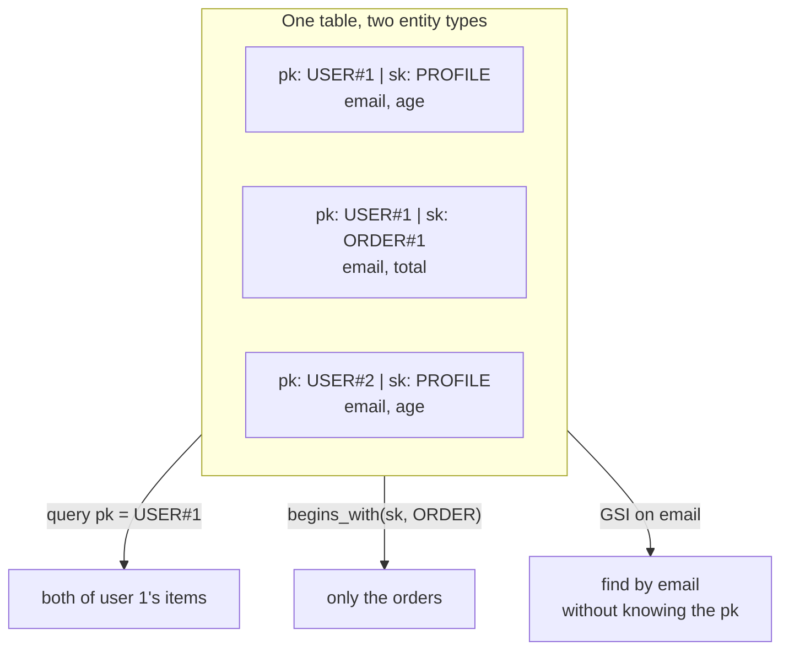

# 02 - DynamoDB: key-value at scale

**Time: 60 minutes.** Assumes [`00-setup`](../00-setup/) is done.

## What you will build

A single table holding both users and their orders, queried five different
ways - including by a field that is not part of the primary key, which is what
a Global Secondary Index is for.



## Why DynamoDB

DynamoDB is the default datastore for anything at Amazon that needs
single-digit-millisecond reads and does not need joins. It scales by
partitioning on a key you choose, which is also its main constraint: **you must
know your access patterns before you design the table.** Get the key wrong and
some queries become impossible without a full table scan.

That constraint is the whole lesson. A relational database lets you defer that
decision; DynamoDB does not. This tutorial walks the design forward - pick keys,
discover a query you cannot serve, add a GSI to serve it.

## Prerequisites

```bash
floci start && eval $(floci env)
```

## 1. Create a table with a composite key

```bash
aws dynamodb create-table --table-name app-data \
  --attribute-definitions AttributeName=pk,AttributeType=S AttributeName=sk,AttributeType=S \
  --key-schema AttributeName=pk,KeyType=HASH AttributeName=sk,KeyType=RANGE \
  --billing-mode PAY_PER_REQUEST
```

Two things to notice.

**The primary key is composite**: a partition key (`pk`, `HASH`) plus a sort key
(`sk`, `RANGE`). Together they must be unique. The partition key decides which
physical partition an item lives on; the sort key orders items within it and is
what makes range queries possible.

**Only key attributes are declared.** `--attribute-definitions` lists `pk` and
`sk` and nothing else, even though the items below will carry `email`, `age` and
`total`. DynamoDB is schemaless except for keys - you declare an attribute only
if an index uses it. This surprises people coming from SQL.

Check it went `ACTIVE`:

```bash
aws dynamodb describe-table --table-name app-data --query 'Table.TableStatus' --output text
```

## 2. Single-table design

Both users *and* orders go in the same table, distinguished by key prefixes:

```bash
aws dynamodb put-item --table-name app-data --item '{"pk":{"S":"USER#1"},"sk":{"S":"PROFILE"},"email":{"S":"ada@example.com"},"age":{"N":"36"}}'
```

```bash
aws dynamodb put-item --table-name app-data --item '{"pk":{"S":"USER#1"},"sk":{"S":"ORDER#1"},"email":{"S":"ada@example.com"},"total":{"N":"99"}}'
```

```bash
aws dynamodb put-item --table-name app-data --item '{"pk":{"S":"USER#2"},"sk":{"S":"PROFILE"},"email":{"S":"grace@example.com"},"age":{"N":"45"}}'
```

The `{"S": ...}` and `{"N": ...}` wrappers are DynamoDB's type descriptors -
`S` for string, `N` for number (sent as a string, to avoid float precision
loss). The SDKs hide this; the CLI does not.

Putting unrelated entity types in one table looks wrong at first. The reason is
that a query can only touch one table, so anything you want to fetch in a single
round trip must share a partition key. Fetching a user *and* their orders in one
call is precisely what this layout buys.

## 3. Get a single item

```bash
aws dynamodb get-item --table-name app-data --key '{"pk":{"S":"USER#1"},"sk":{"S":"PROFILE"}}'
```

`get-item` needs the **complete** primary key - both parts. If you only know the
partition key, you need `query` instead.

## 4. Query a partition

```bash
aws dynamodb query --table-name app-data \
  --key-condition-expression "pk = :p" \
  --expression-attribute-values '{":p":{"S":"USER#1"}}'
```

Two items: the profile and the order. One request, one partition, no scan.

The `:p` placeholder is required - DynamoDB has no string interpolation, and
values always travel separately from the expression. Same idea as a prepared
statement.

## 5. Narrow with the sort key

```bash
aws dynamodb query --table-name app-data \
  --key-condition-expression "pk = :p AND begins_with(sk, :s)" \
  --expression-attribute-values '{":p":{"S":"USER#1"},":s":{"S":"ORDER"}}'
```

Only the order comes back. This is why the `ORDER#1` / `PROFILE` prefix
convention exists - the sort key is doing the work of a WHERE clause, and
`begins_with` is cheap because items are physically stored in sort-key order.

## 6. The query you cannot serve

Find the user with email `grace@example.com`. You do not know their `pk`.

Nothing in the key schema helps. Your only option is a full scan:

```bash
aws dynamodb scan --table-name app-data \
  --filter-expression "email = :e" \
  --expression-attribute-values '{":e":{"S":"grace@example.com"}}'
```

It returns the right answer, and it is the wrong solution. A `scan` reads
**every item in the table** and then discards the ones that do not match. The
filter runs after the read, so you are billed for the whole table and it gets
slower forever as the table grows.

Scans are the single most common DynamoDB mistake. If you find yourself scanning
in application code, your table design is wrong or you need an index.

## 7. Add a Global Secondary Index

A GSI is a second view of the same data under a different key.

```bash
aws dynamodb update-table --table-name app-data \
  --attribute-definitions AttributeName=email,AttributeType=S \
  --global-secondary-index-updates '[{"Create":{"IndexName":"email-index","KeySchema":[{"AttributeName":"email","KeyType":"HASH"}],"Projection":{"ProjectionType":"ALL"}}}]'
```

Note `email` must now be declared in `--attribute-definitions` - it became a key
attribute the moment an index used it.

Now the same question is a targeted query:

```bash
aws dynamodb query --table-name app-data --index-name email-index \
  --key-condition-expression "email = :e" \
  --expression-attribute-values '{":e":{"S":"grace@example.com"}}'
```

`ProjectionType: ALL` copies every attribute into the index, so the query is
served entirely from it. `KEYS_ONLY` or `INCLUDE` copy less, which costs less
storage but may force a second read back to the base table.

## 8. Conditional writes

Prevent an accidental overwrite:

```bash
aws dynamodb put-item --table-name app-data \
  --item '{"pk":{"S":"USER#1"},"sk":{"S":"PROFILE"},"email":{"S":"oops@example.com"}}' \
  --condition-expression "attribute_not_exists(pk)"
```

This fails with `ConditionalCheckFailedException`, and it should - that item
exists, and without the condition `put-item` would have silently replaced it,
losing `age` along the way.

Conditional expressions are DynamoDB's concurrency-control primitive. There are
no transactions in the SQL sense for single items; there is "write only if the
data still looks the way I think it does".

## 9. Atomic counters

```bash
aws dynamodb update-item --table-name app-data \
  --key '{"pk":{"S":"USER#1"},"sk":{"S":"PROFILE"}}' \
  --update-expression "SET age = age + :inc" \
  --expression-attribute-values '{":inc":{"N":"1"}}' \
  --return-values UPDATED_NEW
```

The increment happens server-side. Two concurrent callers both get their
increment applied - no read-modify-write race, because you never read the value
into your application at all.

## 10. The same thing in code

```bash
cd python && pip install -r requirements.txt && python ddb_demo.py
```

```bash
cd node && npm install && node ddb-demo.mjs
```

The Python version uses `boto3.resource("dynamodb")`, which converts Python
types to and from the `{"S": ...}` descriptors automatically. The Node version
uses `DynamoDBDocumentClient` for the same reason. Compare either with the raw
CLI calls above to see exactly what the marshalling layer is doing for you.

## Verify

```bash
./verify.sh
```

## Clean up

```bash
aws dynamodb delete-table --table-name app-data
```

## How this differs from real AWS

Verified by hand against Floci 0.2.0 on 2026-07-31. See
[`docs/COVERAGE.md`](../../docs/COVERAGE.md).

- **GSI writes appear immediately.** In real AWS a GSI is **eventually
  consistent** - an item written to the base table can take a moment to appear
  in the index, and you cannot request a strongly consistent read from a GSI at
  all. Under Floci the index was queryable straight away in every test. Code
  that works here can fail intermittently in production if it writes an item and
  immediately queries a GSI for it. This is the divergence most likely to bite
  you, precisely because it makes broken code look correct.
- **Table creation is instant.** Real AWS tables and new GSIs sit in `CREATING`
  and `BACKFILLING` for a while; production code must wait for `ACTIVE`. Here
  everything is `ACTIVE` immediately, so a missing wait-loop never shows up.
- **No capacity model.** `PAY_PER_REQUEST` is accepted and means nothing. There
  is no throttling, no `ProvisionedThroughputExceededException`, no hot-partition
  penalty. A key design that would melt in production performs fine here - so
  this tutorial cannot teach you partition-key selection by experiment.
- **Item size limits are not enforced** in the same way. Real DynamoDB rejects
  items over 400 KB.
- **DynamoDB Streams are not covered here** and were not probed.

## Exercises

1. Add a second order for `USER#1` and write the query that returns *only*
   orders, sorted newest first. *Hint: look at `--scan-index-forward`.*
2. Combine with tutorial 01: write a script that exports every item to a JSON
   file in S3, then reimports it into a fresh table. What happens to the type
   descriptors on the round trip?
3. The `email-index` GSI has a flaw - two users could share an email, and a GSI
   partition key does not enforce uniqueness. Design a change that makes email
   genuinely unique, and explain what it costs you on every write.
   *Hint: uniqueness in DynamoDB is enforced by the primary key, not an index.*
