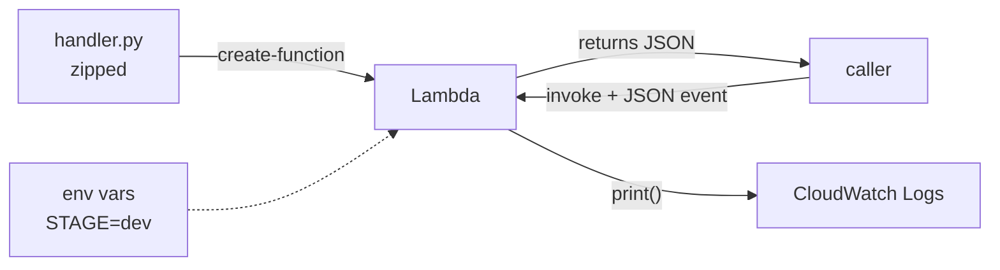

# 03 - Lambda: code without servers

**Time: 60 minutes.** Assumes [`00-setup`](../00-setup/) is done.

## What you will build

A function that lives in the cloud with no server behind it. You upload code,
and it runs when something calls it. You will deploy it, pass it data, make it
fail on purpose, reconfigure it without redeploying, and read its logs.



## Why Lambda

Normally, running code means renting a computer that sits there day and night
waiting for work. You pay for all of it, including the hours nothing happens,
and you have to patch it and keep it alive.

Lambda inverts that. You hand AWS a function. It sits dormant and costs nothing.
When a request arrives, AWS starts a container, runs your function, and throws
the container away. You pay per millisecond of execution.

That trade shapes everything about how you write the code. Your function must
start fast, must not assume anything survives between calls, and must finish
inside its timeout. The constraints below are all downstream of that.

**Floci runs this for real.** Lambda here is not simulated: each invocation
launches an actual Docker container running an actual Python interpreter. When
your function raises an exception, that is a genuine Python traceback.

## Prerequisites

```bash
floci start && eval $(floci env)
```

Docker must be running, since every invocation starts a container.

## 1. Look at the function first

Open [`function/handler.py`](function/handler.py). It is short, and every part
of it matters:

```python
def handler(event, context):
    ...
```

A Lambda handler always takes exactly two arguments.

**`event`** is your input, already parsed from JSON into a dictionary. Whoever
calls the function decides what goes in it.

**`context`** is supplied by the runtime and describes this particular run. The
useful part is `context.get_remaining_time_in_millis()`, which tells you how
long before AWS kills you.

Whatever you return is converted back to JSON and handed to the caller.

## 2. Package it

Lambda does not accept a loose `.py` file. It wants a zip archive.

```bash
cd tutorials/03-lambda
```

```bash
python -c "import zipfile; zipfile.ZipFile('fn.zip','w').write('function/handler.py','handler.py')"
```

The second argument matters. It is the name the file will have *inside* the
archive, and it must line up with the handler string in the next step.

## 3. Deploy it

```bash
aws lambda create-function --function-name greeter --runtime python3.11 --handler handler.handler --role arn:aws:iam::000000000000:role/lambda-basic-execution --zip-file fileb://fn.zip --environment 'Variables={STAGE=dev}' --timeout 10
```

Four parts of that command are worth understanding.

**`--handler handler.handler`** means "in the file `handler.py`, call the
function named `handler`". File name first, then a dot, then the function name.
Getting this wrong is the single most common Lambda deployment error, and the
message you get back is unhelpful.

**`--zip-file fileb://fn.zip`** uses `fileb://`, not `file://`. The `b` means
binary. A zip is not text, and `file://` will corrupt it.

**`--role`** points at an IAM role. On real AWS this role must exist and must
grant permission to write logs, or your function will run but produce no output
you can see. Floci accepts any role ARN without checking. See section 9.

**`--timeout 10`** caps the run at ten seconds. The default is three. Real AWS
allows up to fifteen minutes, and you are billed for the time you use.

Check it came up:

```bash
aws lambda get-function --function-name greeter --query 'Configuration.{State:State,Runtime:Runtime,Handler:Handler}'
```

## 4. Call it

```bash
aws lambda invoke --function-name greeter --payload '{"name":"Sreekant"}' --cli-binary-format raw-in-base64-out response.json
```

```bash
cat response.json
```

You should see your greeting, the stage from the environment variable, and the
remaining milliseconds.

`--cli-binary-format raw-in-base64-out` looks like noise but is not optional.
AWS CLI v2 expects binary parameters to be base64 encoded by default. This flag
says "the payload I am giving you is plain text, treat it as such". Without it
your JSON gets mangled.

Note that `invoke` writes the result to a **file**, not to your terminal. That
is why `response.json` is the last argument.

## 5. Make it fail

This is the part most tutorials skip, and it is the part that matters.

```bash
aws lambda invoke --function-name greeter --payload '{"boom":true}' --cli-binary-format raw-in-base64-out error.json
```

Look carefully at what came back:

```
{
    "StatusCode": 200,
    "FunctionError": "Handled"
}
```

**The status code is 200.** The function crashed, and the status is still 200.

This is not a bug. The 200 describes the *request*: AWS successfully received
it, ran your code, and returned a result. The fact that your code exploded is
reported separately, in `FunctionError`.

Code that checks only the status code will treat every crash as a success. This
is a real and common production bug. Always check `FunctionError`.

The details are in the payload:

```bash
cat error.json
```

You get the exception type, the message, and a genuine Python stack trace,
because a real interpreter really did raise it.

## 6. Reconfigure without redeploying

Your code is fine but you want a different setting. You do not need to rebuild
or reupload anything:

```bash
aws lambda update-function-configuration --function-name greeter --environment 'Variables={STAGE=prod}'
```

```bash
aws lambda invoke --function-name greeter --payload '{"name":"x"}' --cli-binary-format raw-in-base64-out out2.json && cat out2.json
```

`stage` is now `prod`. This separation is the point of environment variables:
one code artifact, promoted through environments by changing configuration
rather than code.

## 7. Read the logs

A Lambda has no terminal attached. `print()` goes to CloudWatch Logs, and that
is your only window into what happened.

AWS creates a log group named after the function automatically:

```bash
aws logs describe-log-groups --query "logGroups[].logGroupName"
```

Find the stream, then read it:

```bash
aws logs describe-log-streams --log-group-name /aws/lambda/greeter --query 'logStreams[0].logStreamName' --output text
```

```bash
aws logs get-log-events --log-group-name /aws/lambda/greeter --log-stream-name 'PASTE_STREAM_NAME' --query 'events[].message' --output text
```

The stream name looks like `2026/07/31/[$LATEST]59211f37`. The date, then the
function version, then a container identifier. Each container that ever served
your function gets its own stream.

### Windows users, read this

If you are in Git Bash, the two commands above will fail with a confusing
message about the log group not existing, naming a path like
`C:/Program Files/Git/aws/lambda/greeter`.

Git Bash sees an argument starting with `/` and assumes it is a file path, so it
rewrites it into a Windows path before the AWS CLI ever sees it. Log group names
begin with a slash, so they get mangled every time.

Disable that conversion for the single command:

```bash
MSYS_NO_PATHCONV=1 aws logs describe-log-streams --log-group-name /aws/lambda/greeter --query 'logStreams[0].logStreamName' --output text
```

Do not export it globally. Other commands rely on that conversion working.

## 8. The same thing in code

```bash
cd python && pip install -r requirements.txt && python deploy.py
```

[`python/deploy.py`](python/deploy.py) does the whole sequence with boto3:
builds the zip in memory, deploys, invokes, triggers the failure, reconfigures,
reads the logs, and cleans up. It also polls for `Active` before invoking, which
is a habit worth keeping even though Floci is ready instantly.

## Verify

```bash
./verify.sh
```

Fifteen checks covering deployment, payload handling, environment variables, the
context object, error reporting, reconfiguration, and log delivery.

## Clean up

```bash
aws lambda delete-function --function-name greeter
```

```bash
rm -f fn.zip response.json error.json out2.json
```

## How this differs from real AWS

Verified by hand against Floci 0.2.0 on 2026-07-31.

- **The IAM role is not checked.** Real AWS validates the role exists and that
  it grants `logs:CreateLogGroup` and friends. A missing permission there means
  your function runs but writes no logs, which is a genuinely confusing failure.
  Floci accepts any ARN, including one for a role that does not exist, so this
  entire category of problem is invisible here.
- **Functions become `Active` immediately.** Real AWS returns from
  `create-function` while the function is still `Pending`, and invoking too
  early fails. Production code polls for `Active`. That bug cannot surface here,
  which is exactly why `deploy.py` polls anyway.
- **No cold starts you can feel.** Real Lambda has meaningful first-invocation
  latency, and mitigating it drives real architectural decisions. Locally
  everything is fast, so you cannot develop any intuition for it here.
- **No concurrency limits or throttling.** Real accounts have a concurrent
  execution ceiling and will reject invocations past it.
- **Billing is invisible.** Real Lambda bills per millisecond and per GB of
  memory, so memory tuning is a real cost exercise. Here it is free.

## Exercises

1. Break the handler string on purpose. Deploy with `--handler wrong.handler`
   and invoke it. Read the error carefully, then fix it. This is the mistake you
   are most likely to make for real, so make it once deliberately.
2. Combine with tutorial 01. Give the function permission to talk to S3, and
   have it write its greeting into a bucket instead of returning it. What does
   the function now need that it did not need before?
3. The function currently trusts its input. Send it `{"name": null}` and then a
   payload with no `name` at all, and see what happens. Then make it validate
   input properly and return a structured error rather than raising.
   *Hint: think about what the caller can actually do with a stack trace.*
