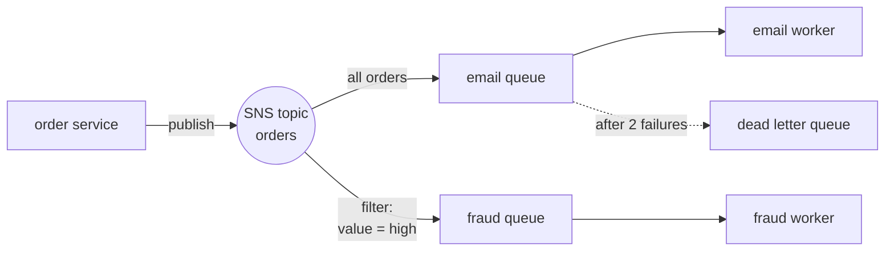

# 04 - SQS and SNS: queues and fan-out

**Time: 60 minutes.** Assumes [`00-setup`](../00-setup/) is done.

## What you will build

An order pipeline. One service announces that an order was placed. Two other
services react to it, and neither one knows the other exists. High value orders
additionally reach a fraud check, filtered by the broker rather than by your
code. Messages that keep failing are parked somewhere safe instead of looping
forever.



## Why queues

Suppose your checkout code sends a confirmation email directly. The email
provider goes down. Now checkout is broken, and you are losing orders because of
something that has nothing to do with taking payment.

A queue breaks that link. Checkout writes a message and moves on. The email
worker picks it up whenever it can. If the worker is down, messages wait. If it
crashes halfway, the message comes back and someone else tries again.

**SQS is a queue.** One message goes to one consumer. Work is handed out.

**SNS is a broadcast.** One message goes to every subscriber at once. Nobody
consumes it in the sense of taking it away from others.

Putting SNS in front of SQS gives you both: publish once, and every interested
team gets a private copy in a queue they control. Adding a fourth consumer later
requires no change to the publisher. That pattern has a name, fan-out, and it is
everywhere at Amazon.

## Prerequisites

```bash
floci start && eval $(floci env)
```

## 1. Create a queue and put something in it

```bash
aws sqs create-queue --queue-name email-queue
```

The response is a queue **URL**, not a name. Almost every other command wants
that URL, so keep it:

```bash
aws sqs get-queue-url --queue-name email-queue --query QueueUrl --output text
```

Send a message:

```bash
aws sqs send-message --queue-url http://localhost:4566/000000000000/email-queue --message-body "order 1001 placed"
```

## 2. Receive it, and understand what receiving means

```bash
aws sqs receive-message --queue-url http://localhost:4566/000000000000/email-queue
```

You get the body, and you also get a **ReceiptHandle**, which is a long opaque
string.

Here is the part that catches everyone:

> **Receiving a message does not remove it from the queue.**

The message is only hidden. It is still there. To actually remove it you must
send a second command, using that receipt handle:

```bash
aws sqs delete-message --queue-url http://localhost:4566/000000000000/email-queue --receipt-handle 'PASTE_RECEIPT_HANDLE'
```

This design is deliberate, and it is the whole reason queues are reliable. If
your worker reads a message and then crashes before finishing, nothing deleted
it, so it reappears and another worker tries again. Nothing is lost.

The cost of that guarantee is that **you must delete explicitly**, and forgetting
to is one of the most common SQS bugs. The symptom is a worker that processes
the same message forever.

One more detail that costs people time: **a receipt handle is issued per
delivery, not per message.** Receive the same message twice and you get two
different handles, and only the newest one works. Storing a handle and trying to
use it after the message has been redelivered gives you an error that reads as
though the message is gone. Always delete using the handle from the receive you
are currently processing.

## 3. Visibility timeout

The window during which a received message stays hidden is the visibility
timeout. Watch it work:

```bash
aws sqs send-message --queue-url http://localhost:4566/000000000000/email-queue --message-body "hide me"
```

```bash
aws sqs receive-message --queue-url http://localhost:4566/000000000000/email-queue --visibility-timeout 30
```

Now immediately try again:

```bash
aws sqs receive-message --queue-url http://localhost:4566/000000000000/email-queue
```

Nothing comes back. The message is invisible for thirty seconds. If you do not
delete it in that window, it returns to the queue and can be delivered again.

Set this longer than your work takes. Set it too short and a slow job gets
handed to a second worker while the first is still running, and the job happens
twice.

## 4. Long polling

An empty queue answers immediately by default, so a worker in a loop spends all
day asking a question that has no answer.

```bash
aws sqs receive-message --queue-url http://localhost:4566/000000000000/email-queue --wait-time-seconds 5
```

That waits up to five seconds for a message to arrive, and returns the instant
one does. On real AWS this matters twice over: fewer wasted requests, and you
are billed per request.

## 5. Dead letter queues

Some messages can never succeed. Malformed input, a record that was deleted,
a bug. Without protection, such a message is received, fails, reappears, fails,
and loops forever while blocking real work.

Create somewhere to park them:

```bash
aws sqs create-queue --queue-name orders-dlq
```

```bash
aws sqs get-queue-attributes --queue-url http://localhost:4566/000000000000/orders-dlq --attribute-names QueueArn --query 'Attributes.QueueArn' --output text
```

Now create a queue that gives up after two attempts:

```bash
aws sqs create-queue --queue-name orders-main --attributes '{"RedrivePolicy":"{\"deadLetterTargetArn\":\"arn:aws:sqs:us-east-1:000000000000:orders-dlq\",\"maxReceiveCount\":\"2\"}","VisibilityTimeout":"1"}'
```

`maxReceiveCount` is the number of delivery attempts allowed before the message
is moved. Send one and receive it repeatedly without deleting it:

```bash
aws sqs send-message --queue-url http://localhost:4566/000000000000/orders-main --message-body "poison"
```

Run this three times, pausing a couple of seconds between runs so the visibility
timeout expires:

```bash
aws sqs receive-message --queue-url http://localhost:4566/000000000000/orders-main
```

Then look in the dead letter queue:

```bash
aws sqs get-queue-attributes --queue-url http://localhost:4566/000000000000/orders-dlq --attribute-names ApproximateNumberOfMessages
```

The poison message is now sitting there, out of the way, still available for you
to inspect. A dead letter queue with items in it is the single most useful alarm
you can put on a queue-based system.

## 6. Fan-out with SNS

```bash
aws sns create-topic --name orders
```

Subscribe the email queue to it, using the queue **ARN** rather than its URL:

```bash
aws sns subscribe --topic-arn arn:aws:sns:us-east-1:000000000000:orders --protocol sqs --notification-endpoint arn:aws:sqs:us-east-1:000000000000:email-queue
```

Publish once:

```bash
aws sns publish --topic-arn arn:aws:sns:us-east-1:000000000000:orders --message "order 1002 placed"
```

```bash
aws sqs receive-message --queue-url http://localhost:4566/000000000000/email-queue --wait-time-seconds 5
```

The message arrived, but the body is not what you sent. It is JSON wrapping your
text:

```json
{"Type":"Notification","MessageId":"...","TopicArn":"...","Timestamp":"...","Message":"order 1002 placed","MessageAttributes":{}}
```

That envelope is SNS telling the subscriber where the message came from. Your
actual content is in the `Message` field. Every consumer has to unwrap it.

## 7. Raw message delivery

If a subscriber does not care about the envelope, switch it off per
subscription:

```bash
aws sns list-subscriptions-by-topic --topic-arn arn:aws:sns:us-east-1:000000000000:orders --query 'Subscriptions[0].SubscriptionArn' --output text
```

```bash
aws sns set-subscription-attributes --subscription-arn 'PASTE_SUBSCRIPTION_ARN' --attribute-name RawMessageDelivery --attribute-value true
```

Publish again and the body is now exactly what you sent. Note this is a property
of the **subscription**, not the topic, so two subscribers to the same topic can
disagree about it.

## 8. Filter policies

Add a second queue that should only see high value orders:

```bash
aws sqs create-queue --queue-name fraud-queue
```

```bash
aws sns subscribe --topic-arn arn:aws:sns:us-east-1:000000000000:orders --protocol sqs --notification-endpoint arn:aws:sqs:us-east-1:000000000000:fraud-queue
```

Attach a filter to that subscription:

```bash
aws sns set-subscription-attributes --subscription-arn 'PASTE_FRAUD_SUBSCRIPTION_ARN' --attribute-name FilterPolicy --attribute-value '{"value":["high"]}'
```

Now publish two messages with different attributes:

```bash
aws sns publish --topic-arn arn:aws:sns:us-east-1:000000000000:orders --message "big order" --message-attributes '{"value":{"DataType":"String","StringValue":"high"}}'
```

```bash
aws sns publish --topic-arn arn:aws:sns:us-east-1:000000000000:orders --message "small order" --message-attributes '{"value":{"DataType":"String","StringValue":"low"}}'
```

The fraud queue receives only the first. The email queue receives both.

The filter runs **inside SNS**, before delivery. The fraud worker never sees the
messages it does not want, so it does no work and costs nothing for them. Doing
this in your own code instead means paying to receive, inspect and discard every
irrelevant message.

## 9. FIFO queues, briefly

Standard queues are fast but make no promise about ordering. If order matters,
use a FIFO queue. The name must end in `.fifo`:

```bash
aws sqs create-queue --queue-name orders.fifo --attributes '{"FifoQueue":"true"}'
```

Every send then needs a group ID, and messages within a group are delivered in
order:

```bash
aws sqs send-message --queue-url http://localhost:4566/000000000000/orders.fifo --message-body "step one" --message-group-id order-1001 --message-deduplication-id d1
```

Use the entity as the group ID, here an order number. Events for one order stay
ordered, while different orders still process in parallel. Making everything one
group destroys your throughput.

## 10. The same thing in code

```bash
cd python && pip install -r requirements.txt && python messaging_demo.py
```

```bash
cd node && npm install && node messaging-demo.mjs
```

Both build the full pipeline: topic, two queues, a filter on one, a dead letter
queue, then publish and consume.

## Verify

```bash
./verify.sh
```

## Clean up

```bash
aws sqs delete-queue --queue-url http://localhost:4566/000000000000/email-queue
```

```bash
aws sns delete-topic --topic-arn arn:aws:sns:us-east-1:000000000000:orders
```

Deleting a queue takes up to sixty seconds on real AWS, and you cannot create
one with the same name during that window.

## How this differs from real AWS

Verified by hand against Floci 0.2.0 on 2026-08-04. Everything in this tutorial
worked, including SNS to SQS delivery, redrive to a dead letter queue, raw
delivery, filter policies, and FIFO ordering. The differences are about
behaviour under load rather than missing features.

- **Standard queues did not reorder or duplicate anything in testing.** Real AWS
  standard queues explicitly allow both. They are at-least-once, not
  exactly-once, and ordering is best effort. Because you cannot reproduce that
  locally, this tutorial cannot teach you to feel it. Write consumers that can
  safely handle the same message twice, and do not take the tidy local behaviour
  as a guarantee. This is the most important line in this section.
- **`ApproximateNumberOfMessages` is exact here.** On real AWS the name is
  honest, because the queue is distributed across many machines. Never write
  logic that depends on that number being right.
- **`receive-message` returned everything available.** Real AWS samples a subset
  of its servers, so a request can come back with fewer messages than are in the
  queue, or with none at all while the queue is not empty. Polling loops must
  keep polling rather than concluding the queue is empty.
- **No quotas, throttling, or per-request billing.** Long polling is a cost
  optimisation on real AWS, and here it is free either way.
- **Message retention and queue deletion delays are not exercised.** Real queues
  hold messages up to fourteen days and take about sixty seconds to delete.

## Exercises

1. Receive a message and do not delete it. Wait for the visibility timeout to
   pass, then receive again. Confirm you get the same message, and look at
   `ApproximateReceiveCount` in its attributes.
2. Combine with tutorial 03. Write a Lambda that reads an order from the queue
   and stores it in the DynamoDB table from tutorial 02. What has to be true
   about that function for a duplicate delivery to be harmless?
3. The fraud queue filters on a message attribute. Attributes are set by the
   publisher, so a buggy or malicious publisher could mislabel a large order as
   low value and skip the fraud check entirely. Design a way to stop that, and
   explain what it costs.
   *Hint: consider who is trusted to describe the message, and whether filtering
   is the right place for a security control at all.*
