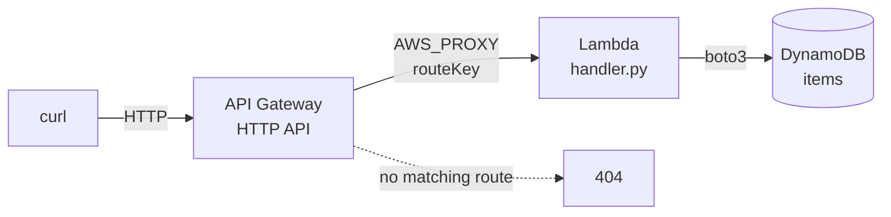

# 05 - A full REST API: API Gateway, Lambda and DynamoDB

**Time: 75 minutes.** This is the capstone. It assumes
[`02-dynamodb`](../02-dynamodb/) and [`03-lambda`](../03-lambda/).

## What you will build

A working REST API with five endpoints, backed by a real database, running
entirely on your laptop. You will create items, list them, fetch one, update it,
and delete it, using `curl` against an HTTP endpoint.



| Method | Path | Does |
|---|---|---|
| `POST` | `/items` | Create an item, returns 201 |
| `GET` | `/items` | List all items |
| `GET` | `/items/{id}` | Fetch one, or 404 |
| `PUT` | `/items/{id}` | Update one, or 404 |
| `DELETE` | `/items/{id}` | Delete one, returns 204 |

## Why this shape

The three previous tutorials each covered one service. Real systems are made of
several wired together, and the wiring is where most of the difficulty lives.

This particular combination is the default way to build an API on AWS. There is
no server to patch, nothing running when no requests arrive, and it scales by
adding more concurrent function invocations rather than more machines. The parts
divide cleanly: API Gateway handles HTTP, Lambda handles logic, DynamoDB handles
storage.

## Prerequisites

```bash
floci start && eval $(floci env)
```

```bash
cd tutorials/05-serverless-api
```

## 1. Create the table

```bash
aws dynamodb create-table --table-name items --attribute-definitions AttributeName=id,AttributeType=S --key-schema AttributeName=id,KeyType=HASH --billing-mode PAY_PER_REQUEST
```

A simple partition key this time. Tutorial 02 used a composite key because it
stored two entity types in one table. Here there is one entity and lookups are
always by id.

## 2. Read the handler

Open [`function/handler.py`](function/handler.py). Two things are worth noticing
before you deploy it.

**It dispatches on `routeKey`.** With payload format 2.0, API Gateway tells the
function which route matched, as the literal string you registered:

```python
route = event.get("routeKey", "")

if route == "POST /items":
    ...
if route == "GET /items/{id}":
    ...
```

One function serves the whole resource. The routing table lives in API Gateway,
and the function only decides what to do once a route has matched.

**There is no endpoint configuration anywhere.**

```python
table = boto3.resource("dynamodb").Table(TABLE_NAME)
```

No `endpoint_url`. Every other tutorial in this series has one, because the code
was running on your machine and had to be told where Floci was. Code running
*inside* Lambda does not: the runtime supplies the location through the
environment. Floci injects `AWS_ENDPOINT_URL=http://localhost.floci.io:4566` so
the function container can reach the emulator, and real AWS supplies the real
service address. **This file is portable exactly as written.**

## 3. Package and deploy the function

```bash
python -c "import zipfile; zipfile.ZipFile('fn.zip','w').write('function/handler.py','handler.py')"
```

```bash
aws lambda create-function --function-name items-api --runtime python3.11 --handler handler.handler --role arn:aws:iam::000000000000:role/lambda-basic-execution --zip-file fileb://fn.zip --environment 'Variables={TABLE_NAME=items}' --timeout 20
```

The table name arrives as an environment variable rather than being hardcoded,
so the same artifact can run against a staging table without rebuilding.

Grab the function ARN. You need it in the next step:

```bash
aws lambda get-function --function-name items-api --query 'Configuration.FunctionArn' --output text
```

## 4. Create the API

```bash
aws apigatewayv2 create-api --name items-api --protocol-type HTTP --query ApiId --output text
```

Keep that API id. Now connect the API to the function:

```bash
aws apigatewayv2 create-integration --api-id YOUR_API_ID --integration-type AWS_PROXY --integration-uri YOUR_FUNCTION_ARN --payload-format-version 2.0 --query IntegrationId --output text
```

`AWS_PROXY` is the important word. It means API Gateway passes the entire
request through to Lambda untouched, and takes whatever the function returns as
the entire response. The alternative is mapping templates that transform
requests in API Gateway configuration, which is powerful and hard to debug.
Proxy integration is the sane default.

That contract is why your handler returns this shape:

```python
{"statusCode": 200, "headers": {...}, "body": "..."}
```

`body` must be a **string**, not an object. Returning a dict there produces a
502, and it is a common first mistake.

## 5. Add routes

```bash
aws apigatewayv2 create-route --api-id YOUR_API_ID --route-key 'POST /items' --target integrations/YOUR_INTEGRATION_ID
```

```bash
aws apigatewayv2 create-route --api-id YOUR_API_ID --route-key 'GET /items' --target integrations/YOUR_INTEGRATION_ID
```

```bash
aws apigatewayv2 create-route --api-id YOUR_API_ID --route-key 'GET /items/{id}' --target integrations/YOUR_INTEGRATION_ID
```

```bash
aws apigatewayv2 create-route --api-id YOUR_API_ID --route-key 'PUT /items/{id}' --target integrations/YOUR_INTEGRATION_ID
```

```bash
aws apigatewayv2 create-route --api-id YOUR_API_ID --route-key 'DELETE /items/{id}' --target integrations/YOUR_INTEGRATION_ID
```

`{id}` is a path parameter. A request to `/items/abc123` matches
`GET /items/{id}`, and the function receives `pathParameters: {"id": "abc123"}`.

All five point at the same integration, and therefore the same function.

## 6. Deploy a stage

Routes do nothing until a stage serves them:

```bash
aws apigatewayv2 create-stage --api-id YOUR_API_ID --stage-name prod --auto-deploy
```

`--auto-deploy` means later route changes go live immediately. Without it you
must create a deployment by hand every time, which is a confusing way to lose
twenty minutes wondering why an edit had no effect.

## 7. Call it

On real AWS the invoke URL is the one `get-api` reports. Under Floci it is not.
Use this pattern:

```
http://localhost:4566/restapis/{api-id}/{stage}/_user_request_/{path}
```

Set it once:

```bash
export API=YOUR_API_ID
```

```bash
export BASE="http://localhost:4566/restapis/$API/prod/_user_request_"
```

Create something:

```bash
curl -s -X POST "$BASE/items" -H 'Content-Type: application/json' -d '{"name":"widget","price":9}'
```

```json
{"id": "3f2b...", "name": "widget", "price": 9}
```

List everything:

```bash
curl -s "$BASE/items"
```

Fetch one, using the id you just got back:

```bash
curl -s "$BASE/items/PASTE_THE_ID"
```

Update it:

```bash
curl -s -X PUT "$BASE/items/PASTE_THE_ID" -H 'Content-Type: application/json' -d '{"name":"gadget","price":25}'
```

Delete it:

```bash
curl -s -o /dev/null -w '%{http_code}\n' -X DELETE "$BASE/items/PASTE_THE_ID"
```

```
204
```

Then confirm it is gone:

```bash
curl -s -o /dev/null -w '%{http_code}\n' "$BASE/items/PASTE_THE_ID"
```

```
404
```

## 8. Check the status codes

A REST API is judged as much by its failure responses as its successes. Try
these:

```bash
curl -s -o /dev/null -w '%{http_code}\n' -X POST "$BASE/items" -H 'Content-Type: application/json' -d '{"price":1}'
```

`400`, because the handler validates that `name` is present before writing.
Storing malformed records is worse than refusing them.

```bash
curl -s -o /dev/null -w '%{http_code}\n' "$BASE/nothing-here"
```

`404`, and note this one comes from **API Gateway**, not your function. No route
matched, so the Lambda was never invoked. That distinction matters when you are
reading logs and wondering why a request left no trace.

## 9. The same thing in code

```bash
cd python && pip install -r requirements.txt && python deploy.py
```

```bash
cd node && npm install && node deploy.mjs
```

Both build the entire stack from nothing, exercise all five endpoints, print the
responses, and tear it down.

## Verify

```bash
./verify.sh
```

Twenty three checks covering deployment, all five endpoints, status codes, path
parameters, persistence, and routing failures.

## Clean up

```bash
aws apigatewayv2 delete-api --api-id YOUR_API_ID
```

```bash
aws lambda delete-function --function-name items-api
```

```bash
aws dynamodb delete-table --table-name items
```

```bash
rm -f fn.zip
```

## How this differs from real AWS

Verified by hand against Floci 0.2.0 on 2026-08-06. The API itself is faithful:
routing, path parameters, query strings, request bodies, and 404 on unmatched
routes all behave correctly.

- **The invoke URL is different, and `get-api` reports a URL that does not
  work.** It returns `https://{api-id}.execute-api.{region}.amazonaws.com`,
  which is correct for real AWS and unreachable from your machine. Locally you
  must use `http://localhost:4566/restapis/{api-id}/{stage}/_user_request_/`.
  Anything that reads `ApiEndpoint` and calls it will fail here.
- **API Gateway was never granted permission to invoke the Lambda.** On real AWS
  this stack does not work until you add a resource policy:

  ```bash
  aws lambda add-permission --function-name items-api --statement-id apigw --action lambda:InvokeFunction --principal apigateway.amazonaws.com
  ```

  Skipping it produces a 500 with a permissions error, and it is one of the most
  common ways a first serverless API fails. Because Floci does not enforce IAM
  at all (see [`06-iam`](../06-iam/)), the step is invisible here. **Remember it
  exists.** This tutorial cannot teach it to you by letting you fail.
- **No throttling, quotas, or usage plans.** Real API Gateway rate limits by
  default and bills per request.
- **Authorizers, custom domains and CORS were not tested** and are not covered.
  An API that works locally may still be blocked by a browser on real AWS until
  CORS is configured.
- **Cold starts are not observable**, as in tutorial 03, so the latency profile
  here tells you nothing about production.

## Exercises

1. Add a `GET /items/{id}/price` route that returns only the price field. You
   should need one new route and one new branch in the handler, and no changes
   to the integration or the stage.
2. The handler uses `scan` for `GET /items`, which tutorial 02 called an
   anti-pattern. Add a `category` attribute to items and a global secondary
   index on it, then add `GET /items?category=tools` that queries the index
   instead of scanning. What happens to requests that omit the parameter?
3. Right now anyone can call this API. Read the `add-permission` note above,
   then work out what would need to change for only authenticated callers to
   reach it, and which parts of that you could genuinely test on Floci given
   what tutorial 06 found. Be specific about what you would have to verify
   against a real AWS account instead.
   *Hint: separate the parts that are configuration from the parts that are
   enforcement.*
