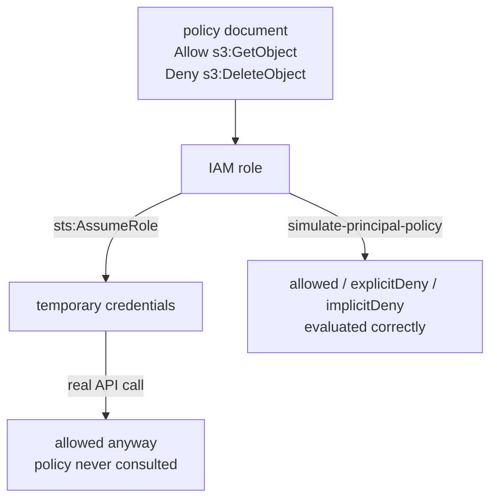

# 06 - IAM, STS and Secrets Manager: identity without enforcement

**Time: 70 minutes.** Assumes [`00-setup`](../00-setup/) is done.

> **Read this before anything else.**
>
> Floci stores IAM policies faithfully and evaluates them correctly when you
> ask it to. It does **not** enforce them. An action forbidden by an explicit
> `Deny` still succeeds. Credentials you invented on the spot still work.
>
> That is not a footnote. It is the subject of this tutorial. You are going to
> prove it yourself, and then learn the one tool here that does evaluate
> policies honestly.

## What you will build

A role, a policy, and a set of temporary credentials. Then two experiments: one
showing that the policy is ignored on a real call, and one showing that the
policy simulator gets the same policy exactly right. After that, secrets that
genuinely work, and an encryption service that genuinely does not.



## Why IAM

Every request to AWS carries an identity, and every request is checked against
policy before it runs. IAM is that system. It is the reason a compromised
service cannot read your customer database, and misconfiguring it is behind a
large share of real cloud breaches.

Three pieces are worth separating in your head:

- A **policy** is a JSON document listing actions, resources, and whether they
  are allowed or denied. It is data. On its own it does nothing.
- A **role** is an identity that can be assumed temporarily. It has two
  policies attached, and confusing them is the classic beginner error. The
  **trust policy** says *who may become this role*. The **permission policy**
  says *what this role may then do*.
- **STS** issues the short-lived credentials you get when you assume a role.

Roles matter because the alternative is long-lived access keys sitting in
config files. Temporary credentials expire on their own, which turns a leaked
key from a disaster into an inconvenience.

## Prerequisites

```bash
floci start && eval $(floci env)
```

## 1. Create a role

The trust policy comes first, because a role cannot exist without one:

```bash
aws iam create-role --role-name app-role --assume-role-policy-document '{"Version":"2012-10-17","Statement":[{"Effect":"Allow","Principal":{"AWS":"*"},"Action":"sts:AssumeRole"}]}'
```

`Principal: {"AWS": "*"}` means anyone may assume this role. That is deliberately
careless and fine for a local exercise. In production you name a specific
account, service, or user, and getting this wrong is how roles get assumed by
people who should not have them.

Now attach a permission policy saying what the role may do:

```bash
aws iam put-role-policy --role-name app-role --policy-name app-permissions --policy-document '{"Version":"2012-10-17","Statement":[{"Effect":"Allow","Action":"s3:GetObject","Resource":"*"},{"Effect":"Deny","Action":"s3:DeleteObject","Resource":"*"}]}'
```

Read that policy carefully. It permits reading objects and explicitly forbids
deleting them.

Confirm it was stored:

```bash
aws iam get-role-policy --role-name app-role --policy-name app-permissions
```

## 2. Assume the role

```bash
aws sts assume-role --role-arn arn:aws:iam::000000000000:role/app-role --role-session-name my-session
```

You get back an access key, a secret key, a session token, and an expiry. Three
values instead of two, because temporary credentials always carry a token.

Load them into your shell:

```bash
eval $(aws sts assume-role --role-arn arn:aws:iam::000000000000:role/app-role --role-session-name my-session --query 'Credentials.[AccessKeyId,SecretAccessKey,SessionToken]' --output text | awk '{print "export AWS_ACCESS_KEY_ID="$1" AWS_SECRET_ACCESS_KEY="$2" AWS_SESSION_TOKEN="$3}')
```

Check who you are now:

```bash
aws sts get-caller-identity --query Arn --output text
```

```
arn:aws:sts::000000000000:assumed-role/app-role/floci-session
```

Your identity really did change. You were `root` a moment ago. This part works.

## 3. The experiment

Your policy explicitly denies `s3:DeleteObject`. Try it.

```bash
aws s3api create-bucket --bucket enforcement-test
```

```bash
printf 'delete me\n' > f.txt && aws s3api put-object --bucket enforcement-test --key f.txt --body f.txt
```

Note that `s3:PutObject` was not allowed by your policy either. On real AWS
that call fails with `AccessDenied`. Here it succeeded.

Now the explicitly denied action:

```bash
aws s3api delete-object --bucket enforcement-test --key f.txt
```

That succeeds too.

**Nothing was enforced.** The policy is stored, readable, and correct. It was
simply never consulted.

If you want to see how far this goes, throw the credentials away entirely and
use ones you invent:

```bash
AWS_ACCESS_KEY_ID=AKIAFAKEFAKEFAKE AWS_SECRET_ACCESS_KEY=nonsense AWS_SESSION_TOKEN= aws s3api list-buckets
```

That works as well. Floci checks that a request is shaped like a signed AWS
request. It does not check who signed it or whether they were allowed.

### Why this matters beyond the emulator

The lesson here is bigger than Floci. You just watched a system accept a
security policy, store it, return it accurately when asked, and then ignore it
completely. Every observable signal said the control was in place.

**A successful API response is not evidence that a security control works.** The
only evidence is a test that proves the forbidden thing actually fails. That
habit is worth more than any particular policy syntax.

## 4. The tool that does evaluate policies

Reset to the default credentials first:

```bash
eval $(floci env)
```

Floci implements `simulate-principal-policy`, and it evaluates policies
properly. Ask it about the action your policy allows:

```bash
aws iam simulate-principal-policy --policy-source-arn arn:aws:iam::000000000000:role/app-role --action-names s3:GetObject --resource-arns "arn:aws:s3:::enforcement-test/f.txt" --query 'EvaluationResults[].[EvalActionName,EvalDecision]' --output text
```

```
s3:GetObject    allowed
```

Now the one it denies:

```bash
aws iam simulate-principal-policy --policy-source-arn arn:aws:iam::000000000000:role/app-role --action-names s3:DeleteObject --resource-arns "arn:aws:s3:::enforcement-test/f.txt" --query 'EvaluationResults[].[EvalActionName,EvalDecision]' --output text
```

```
s3:DeleteObject explicitDeny
```

And one the policy never mentions:

```bash
aws iam simulate-principal-policy --policy-source-arn arn:aws:iam::000000000000:role/app-role --action-names ec2:TerminateInstances --resource-arns "*" --query 'EvaluationResults[].[EvalActionName,EvalDecision]' --output text
```

```
ec2:TerminateInstances   implicitDeny
```

Those three answers are the whole of IAM evaluation logic:

| Decision | Meaning |
|---|---|
| `allowed` | Something granted it, and nothing denied it |
| `explicitDeny` | A `Deny` statement matched. This always wins, no matter what allows it |
| `implicitDeny` | Nothing mentioned it. Access is denied by default |

The default is deny. Permissions are only ever added by an explicit `Allow`,
and any `Deny` anywhere overrides every `Allow`. That ordering is why a broad
`Deny` is such a useful safety net.

**Use the simulator as your test harness.** It is the only thing in this
environment that tells you the truth about a policy, and the real AWS console
has the same tool for the same reason.

## 5. Secrets Manager

This one genuinely works.

```bash
aws secretsmanager create-secret --name db-credentials --secret-string '{"user":"admin","pass":"s3cret"}'
```

```bash
aws secretsmanager get-secret-value --secret-id db-credentials --query SecretString --output text
```

The point of a secrets store is that credentials live outside your code and
your repository. Your application asks for them at runtime, so rotating a
password never means redeploying.

Rotate it:

```bash
aws secretsmanager put-secret-value --secret-id db-credentials --secret-string '{"user":"admin","pass":"rotated"}'
```

```bash
aws secretsmanager get-secret-value --secret-id db-credentials --query SecretString --output text
```

The old value is not gone. Secrets are versioned, and the previous one is
labelled `AWSPREVIOUS`:

```bash
aws secretsmanager get-secret-value --secret-id db-credentials --version-stage AWSPREVIOUS --query SecretString --output text
```

That staging is what makes safe rotation possible. You write the new secret,
let running systems finish with the old one, and roll back by moving a label
rather than by restoring a backup.

SSM Parameter Store does a similar job for configuration, with `SecureString`
for sensitive values:

```bash
aws ssm put-parameter --name /app/db/password --value "supersecret" --type SecureString
```

```bash
aws ssm get-parameter --name /app/db/password --with-decryption --query 'Parameter.Value' --output text
```

## 6. KMS, and a serious warning

KMS is the service that encrypts things. Create a key and use it:

```bash
aws kms create-key --description "app key"
```

```bash
aws kms encrypt --key-id YOUR_KEY_ID --plaintext "$(printf 'ATTACK_AT_DAWN' | base64)" --query CiphertextBlob --output text
```

You get back a long base64 string that looks exactly like ciphertext.

Decode it:

```bash
echo 'PASTE_THE_CIPHERTEXT' | base64 -d
```

```
kms:v2:5e0f4381-41ff-4a1f-bcbb-c06120a02779:73c0449db0d2ba26::QVRUQUNLX0FUX0RBV04=
```

That trailing field is ordinary base64. Decode it too:

```bash
echo 'QVRUQUNLX0FUX0RBV04=' | base64 -d
```

```
ATTACK_AT_DAWN
```

**Your plaintext was never encrypted.** It was base64 encoded and wrapped in a
label. Anyone holding the ciphertext can read it, with no key and no
permissions.

`encrypt` and `decrypt` round-trip correctly, so any code you write against KMS
here will behave properly and port to real AWS unchanged. That is the useful
part, and it is why this tutorial still covers KMS. But nothing you put through
it locally is protected in any sense. Never place real secrets in a local Floci
instance and never treat its output as safe to store or transmit.

## 7. The same thing in code

```bash
cd python && pip install -r requirements.txt && python iam_demo.py
```

```bash
cd node && npm install && node iam-demo.mjs
```

Both create the role, assume it, demonstrate that the deny is ignored, then run
the same policy through the simulator and show it answering correctly.

## Verify

```bash
./verify.sh
```

The checks in this tutorial are unusual. Several of them assert that something
insecure happens, because that is the documented behaviour. If Floci ever starts
enforcing IAM, those checks will fail and tell us to rewrite this page. That is
the intended design.

## Clean up

```bash
aws iam delete-role-policy --role-name app-role --policy-name app-permissions && aws iam delete-role --role-name app-role
```

```bash
aws s3 rb s3://enforcement-test --force
```

```bash
aws secretsmanager delete-secret --secret-id db-credentials --force-delete-without-recovery
```

## How this differs from real AWS

Verified by hand against Floci 0.2.0 on 2026-08-06. This is the largest gap in
the entire tutorial series.

- **IAM is not enforced anywhere.** Verified across seven separate cases: a role
  with no permissions, an explicit `Deny`, an IAM user with a deny-all policy,
  an S3 bucket policy with an explicit `Deny`, a role that does not exist, a
  trust policy denying everyone, and credentials invented at random. Every one
  of them was allowed through.
- **Any credentials work.** Floci validates that a request looks signed. It does
  not verify the signature against a known secret, so `AKIAFAKEFAKEFAKE` is as
  good as anything else.
- **`sts:AssumeRole` succeeds for roles that do not exist**, and ignores the
  trust policy entirely. On real AWS both are hard failures.
- **The role session name is discarded.** Ask for `my-session` and the resulting
  ARN says `floci-session`. Real AWS puts your session name in the ARN, which is
  how CloudTrail attributes actions to a person. Do not build anything that
  parses identity out of that ARN.
- **`simulate-custom-policy` is not supported.** Only
  `simulate-principal-policy` works, so a policy must be attached to a real role
  before you can evaluate it. On real AWS you can test a draft policy directly.
- **KMS does not encrypt.** Covered in section 6. The ciphertext contains the
  plaintext in base64.
- **Secrets Manager and SSM SecureString store values in the clear** for the
  same reason. They behave correctly as APIs, including version staging, but
  they provide no confidentiality here.

What this means for you: **do not use these tutorials to learn least-privilege
policy authoring by experiment.** Use the simulator, which is correct, and
verify anything security-critical against a real AWS account before trusting it.

## Exercises

1. Write a policy that allows reading from one specific bucket and nothing else.
   Attach it to a role, then use the simulator to confirm three things: reading
   from that bucket is `allowed`, reading from a different bucket is
   `implicitDeny`, and deleting from the allowed bucket is `implicitDeny`.
2. Combine with tutorial 03. Give a Lambda function an execution role whose
   policy allows writing to DynamoDB. Then use the simulator to check whether
   that role could also read every table in the account, and tighten the
   `Resource` field until it cannot.
3. A teammate proposes storing an API key in SSM Parameter Store as a
   `SecureString` on a shared local Floci instance, arguing that it is encrypted.
   Using what you found in section 6, explain precisely why that is wrong, and
   describe what an attacker with read access to that instance actually obtains.
   *Hint: work out which component is supposed to be doing the encrypting, and
   check whether it exists here at all.*
