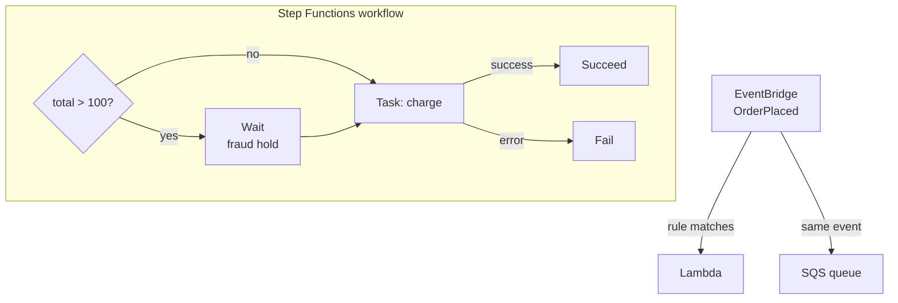

# 07 - Orchestration: Step Functions and EventBridge

**Time: 70 minutes.** Assumes [`03-lambda`](../03-lambda/) and
[`04-messaging`](../04-messaging/).

## What you will build

A workflow that makes decisions, calls a function, handles failure, and
processes a batch. Then an event bus that routes events to the right consumers
based on their content.



## Why orchestration

Tutorial 04 connected services by passing messages. That works until a process
has *steps*: do this, then check something, then depending on the answer do one
of two things, and if any of it fails, clean up.

You can write that as code inside one Lambda, and people do. The trouble starts
when a step takes an hour, or when you need to know which step a stuck order is
on, or when one step fails and you want to resume rather than start over.

**Step Functions** moves the control flow out of your code and into a definition
the platform executes. Every transition is recorded, so "where is order 1234"
becomes a question with an answer.

**EventBridge** does something different. It routes events by *content*, so a
publisher does not name its consumers. Tutorial 04 did this with SNS topics,
where a subscriber picks a topic. EventBridge lets a subscriber describe the
events it wants, and the bus works out who gets what.

> **A warning specific to this tutorial.** One important Step Functions feature,
> `Retry`, is accepted by Floci and never executed. It is covered in section 5,
> and it is the reason to read section 9 before trusting anything you build here.

## Prerequisites

```bash
floci start && eval $(floci env)
```

```bash
cd tutorials/07-orchestration
```

## 1. Deploy the workflow step

Look at [`function/charge.py`](function/charge.py) first. It is deliberately
small, and it raises when the total is negative, which is the hook for the error
handling later.

```bash
python -c "import zipfile; zipfile.ZipFile('fn.zip','w').write('function/charge.py','charge.py')"
```

```bash
aws lambda create-function --function-name charge --runtime python3.11 --handler charge.handler --role arn:aws:iam::000000000000:role/lambda-basic-execution --zip-file fileb://fn.zip --timeout 20
```

```bash
aws lambda get-function --function-name charge --query 'Configuration.FunctionArn' --output text
```

Keep that ARN.

## 2. A workflow with a decision

Save this as `workflow.json`, substituting your function ARN:

```json
{
  "Comment": "Order processing",
  "StartAt": "CheckValue",
  "States": {
    "CheckValue": {
      "Type": "Choice",
      "Choices": [
        { "Variable": "$.total", "NumericGreaterThan": 100, "Next": "FraudHold" }
      ],
      "Default": "Charge"
    },
    "FraudHold": { "Type": "Wait", "Seconds": 2, "Next": "Charge" },
    "Charge": {
      "Type": "Task",
      "Resource": "YOUR_FUNCTION_ARN",
      "Catch": [{ "ErrorEquals": ["States.ALL"], "Next": "Rejected" }],
      "Next": "Done"
    },
    "Done": { "Type": "Succeed" },
    "Rejected": { "Type": "Fail", "Error": "ChargeFailed", "Cause": "the charge step raised" }
  }
}
```

Read it as a diagram in text. `StartAt` names the first state, and every state
either names its `Next` or ends the execution.

`$.total` is a JSONPath expression referring to the input. Step Functions passes
JSON from state to state, and `$` is whatever the current state received.

```bash
aws stepfunctions create-state-machine --name order-flow --role-arn arn:aws:iam::000000000000:role/sfn --definition file://workflow.json --query stateMachineArn --output text
```

## 3. Run it

A small order takes the default branch:

```bash
aws stepfunctions start-execution --state-machine-arn YOUR_STATE_MACHINE_ARN --input '{"orderId":"A1","total":42}' --query executionArn --output text
```

```bash
aws stepfunctions describe-execution --execution-arn YOUR_EXECUTION_ARN --query '{status:status,output:output}'
```

```json
{
    "status": "SUCCEEDED",
    "output": "{\"orderId\":\"A1\",\"total\":42,\"charged\":true,\"status\":\"PAID\"}"
}
```

Note the output contains the original fields *and* the new ones, because the
handler merged rather than replaced. A Task that returns only its own result
silently discards everything upstream, which is a common and confusing bug.

Now a large order, which should take the `FraudHold` branch and take about two
seconds longer:

```bash
aws stepfunctions start-execution --state-machine-arn YOUR_STATE_MACHINE_ARN --input '{"orderId":"A2","total":500}'
```

And one that fails:

```bash
aws stepfunctions start-execution --state-machine-arn YOUR_STATE_MACHINE_ARN --input '{"orderId":"A3","total":-5}'
```

That one ends `FAILED`, with the error and cause from the `Fail` state. The
`Catch` block routed the exception there instead of letting the whole execution
crash unexplained.

## 4. See what happened

This is the thing you cannot get from a Lambda that does everything itself:

```bash
aws stepfunctions get-execution-history --execution-arn YOUR_EXECUTION_ARN --query 'events[].type' --output text
```

```
ExecutionStarted  ChoiceStateEntered  ChoiceStateExited  TaskStateEntered
TaskStateExited  SucceedStateEntered  SucceedStateExited  ExecutionSucceeded
```

Every transition is recorded. For a stuck or failed process this is the
difference between reading logs hopefully and knowing exactly which step it
reached.

## 5. Retry, and why you cannot test it here

Real workflows retry transient failures. The syntax is a `Retry` block on the
Task:

```json
"Charge": {
  "Type": "Task",
  "Resource": "YOUR_FUNCTION_ARN",
  "Retry": [
    { "ErrorEquals": ["States.ALL"], "IntervalSeconds": 2, "MaxAttempts": 3, "BackoffRate": 2.0 }
  ],
  "Catch": [{ "ErrorEquals": ["States.ALL"], "Next": "Rejected" }],
  "Next": "Done"
}
```

On real AWS that means: try, and on failure wait 2 seconds and try again, then 4
seconds, then 8. Four invocations in total before `Catch` takes over.

**Under Floci the Task runs exactly once and goes straight to `Catch`.**

That is not a guess. `charge.py` logs a line **before** it validates, so every
attempt leaves a trace even when the call goes on to fail. Add the `Retry` block
above, run an execution with a negative total, then count the attempts:

```bash
MSYS_NO_PATHCONV=1 aws logs describe-log-streams --log-group-name /aws/lambda/charge --query 'logStreams[].logStreamName' --output text
```

```bash
MSYS_NO_PATHCONV=1 aws logs get-log-events --log-group-name /aws/lambda/charge --log-stream-name 'PASTE_STREAM_NAME' --query 'events[].message' --output text
```

You will find **one** `charge attempt` line, not four. The `Retry` block was
accepted, validated, stored, and ignored.

That ordering inside the handler matters. Had the function validated first and
logged second, a failing call would log nothing, and counting log lines would
return zero whether or not retries happened. A measurement that cannot
distinguish the two answers is not evidence.

Keep writing `Retry` blocks anyway, because they are correct for production. But
you cannot verify retry behaviour here, and anything that depends on retries
being real must be tested against a real AWS account.

## 6. Map: the same step over a list

```json
{
  "StartAt": "EachOrder",
  "States": {
    "EachOrder": {
      "Type": "Map",
      "ItemsPath": "$.orders",
      "Iterator": {
        "StartAt": "Charge",
        "States": { "Charge": { "Type": "Task", "Resource": "YOUR_FUNCTION_ARN", "End": true } }
      },
      "End": true
    }
  }
}
```

Given `{"orders":[{"orderId":"B1","total":10},{"orderId":"B2","total":20}]}` the
output is an array with one entry per input item. `Map` is how you process a
batch without writing a loop in application code, and each iteration is tracked
separately.

`Parallel` is its sibling: fixed branches that all run and whose results are
collected into an array, rather than one branch repeated over a list.

## 7. EventBridge

Step Functions runs a process you started. EventBridge decides *what should
happen* when something occurs.

Create a rule that matches only the events you care about:

```bash
aws events put-rule --name order-placed --event-pattern '{"source":["shop.orders"],"detail-type":["OrderPlaced"]}'
```

Point it at a queue:

```bash
aws sqs create-queue --queue-name order-events
```

```bash
aws events put-targets --rule order-placed --targets Id=1,Arn=arn:aws:sqs:us-east-1:000000000000:order-events
```

Publish a matching event:

```bash
aws events put-events --entries '[{"Source":"shop.orders","DetailType":"OrderPlaced","Detail":"{\"orderId\":\"A1\",\"total\":42}"}]'
```

And one that should not match, because the source is different:

```bash
aws events put-events --entries '[{"Source":"shop.shipping","DetailType":"OrderPlaced","Detail":"{\"orderId\":\"B2\"}"}]'
```

```bash
aws sqs receive-message --queue-url http://localhost:4566/000000000000/order-events --max-number-of-messages 10 --wait-time-seconds 5 --query 'Messages[].Body' --output text
```

Only the first arrives, wrapped in the EventBridge envelope:

```json
{"version":"0","id":"...","source":"shop.orders","detail-type":"OrderPlaced","account":"000000000000","time":"...","region":"us-east-1","detail":{"orderId":"A1","total":42},"event-bus-name":"default"}
```

Your payload is in `detail`. Everything else is routing metadata.

Note that `put-events` returned `FailedEntryCount: 0` for **both** events. An
event that matches no rule is not an error. It is simply delivered to nobody,
which is the single most confusing thing about debugging EventBridge: silence
is the normal response to a pattern that does not match.

## 8. The same thing in code

```bash
cd python && pip install -r requirements.txt && python orchestration_demo.py
```

```bash
cd node && npm install && node orchestration-demo.mjs
```

Both build the workflow, run all three paths, print the execution history, then
set up the event bus and show matching and non-matching events.

## Verify

```bash
./verify.sh
```

## Clean up

```bash
aws stepfunctions delete-state-machine --state-machine-arn YOUR_STATE_MACHINE_ARN
```

```bash
aws lambda delete-function --function-name charge
```

```bash
aws events remove-targets --rule order-placed --ids 1 && aws events delete-rule --name order-placed
```

```bash
aws sqs delete-queue --queue-url http://localhost:4566/000000000000/order-events
```

## How this differs from real AWS

Verified by hand against Floci 0.2.0 on 2026-08-06. Execution is genuine:
`Choice`, `Task`, `Wait`, `Map`, `Parallel`, `Succeed`, `Fail` and `Catch` all
behave correctly, and `Wait` really waits.

- **`Retry` is accepted and never executed.** Covered in section 5. A Task with
  `MaxAttempts: 3` runs once, not four times. Retry logic that looks correct
  here does something completely different in production, including timing and
  the idempotency your step then needs. This is the most important line in this
  section.
- **Execution history is much coarser.** Real AWS records
  `LambdaFunctionScheduled`, `LambdaFunctionStarted` and `LambdaFunctionFailed`
  around every Task. Floci records only the state entered and exited, so a
  failure inside a Task leaves no trace in the history at all. You can see which
  state ran, but not what happened inside it.
- **EventBridge cannot trigger a Step Functions state machine.** `put-targets`
  accepts the target and returns `FailedEntryCount: 0`, and then no execution
  ever starts. Targets that do work are **SQS** and **Lambda**, both verified.
  If you need an event to begin a workflow locally, route it through a Lambda
  that calls `start-execution` itself.
- **Scheduled rules were not tested.** `ScheduleExpression` rules using `rate()`
  or `cron()` are not covered here and should not be assumed to fire.
- **No service integrations beyond Lambda.** Real Step Functions can call
  DynamoDB, SQS and dozens of other services directly from a Task without a
  Lambda in between. Only the Lambda Task type was verified.

## Exercises

1. Add a second `Choice` branch that routes orders over 1000 to a new `Fail`
   state called `ManualReview`. Confirm all three paths still work by running one
   execution for each.
2. Combine with tutorial 04. Add an SQS queue as a second EventBridge target on
   the same rule, so one published event reaches both a Lambda and a queue.
   Compare the envelope each receives.
3. Section 5 showed that `Retry` does nothing here. Design a way to verify that
   a retry policy is correct *without* a real AWS account, and be specific about
   what your approach can and cannot prove.
   *Hint: you cannot test the platform, but you can test your own assumptions
   about it. Consider what makes a step safe to run more than once.*
